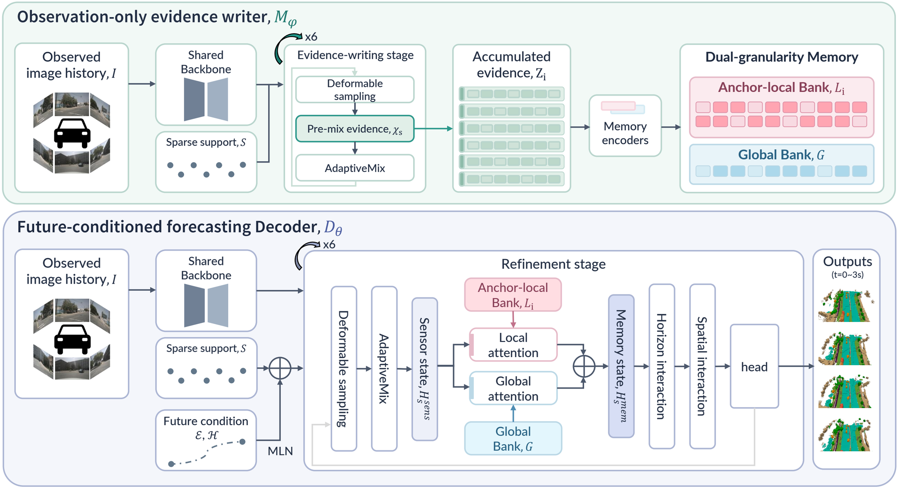
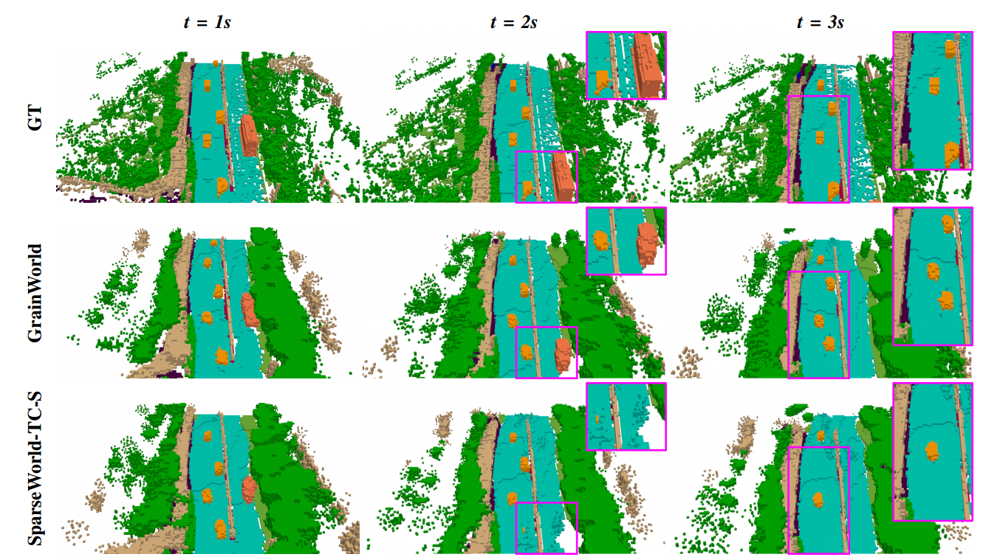

# GrainWorld

**Dual-granularity memory for camera-only 4D occupancy forecasting.**

<p align="center">
  
</p>

GrainWorld predicts future 3D semantic occupancy (t = 0–3 s) from surround-view image history alone.
An **observation-only evidence writer** $M_\varphi$ accumulates deformable-sampled evidence into a
**dual-granularity memory** — an *anchor-local bank* $L_i$ that retains instance-level detail and a
*global bank* $G$ that retains scene-level context. A **future-conditioned forecasting decoder**
$D_\theta$ then reads both banks through local / global attention and refines sparse queries over
horizon and space before decoding the occupancy volume.

---

## Qualitative results

<p align="center">
  
</p>

<p align="center"><em>Forecasts at t = 1 s, 2 s and 3 s. GrainWorld keeps thin structures and small
dynamic agents alive at long horizons, where the baseline lets them dissolve into the background.</em></p>

---

## Data preparation

We use **nuScenes** images with **Occ3D-nuScenes** occupancy labels (the `gts` folder).
Download both, then link them under `data/`:

```bash
mkdir -p data
ln -s /path/to/nuscenes data/nuscenes
```

Expected layout:

```
data/nuscenes/
├── samples/
├── sweeps/
├── maps/
├── v1.0-trainval/
└── gts/                 # Occ3D-nuScenes occupancy labels
```

Generate the annotation pickles:

```bash
python tools/create_data.py --root-path data/nuscenes --version v1.0-trainval
```

> All scripts below assume this layout. If your dataset lives elsewhere, pass the absolute path to
> `--data-root` / `--occ-root` / `--ann-root` instead of creating the symlink.

---

## Pretrained backbone

Training initialises the image backbone from a nuImages-pretrained Cascade Mask R-CNN checkpoint
(`cascade_mask_rcnn_r50_fpn_coco-20e_20e_nuim`), following common practice for camera-based
occupancy models. Place it in `ckpts/`:

```bash
mkdir -p ckpts
# download cascade_mask_rcnn_r50_fpn_coco-20e_20e_nuim_*.pth into ckpts/
```

---

## Training

```bash
bash scripts/train.sh \
  --pretrained ckpts/cascade_mask_rcnn_r50_fpn_coco-20e_20e_nuim.pth \
  --data-root data/nuscenes \
  --occ-root  data/nuscenes/gts \
  --ann-root  data/nuscenes \
  --work-dir  work_dirs/grainworld \
  --gpus 0,1,2,3 \
  --batch-size 2 \
  --effective-batch 8 \
  --epochs 80 \
  --lr 3e-4
```

Checkpoints and logs are written to `--work-dir`.

**On `--batch-size` vs `--effective-batch`.** `--batch-size` is the *per-GPU* batch size; the
`--effective-batch` you request is reached by gradient accumulation:

$$
B_{\text{eff}} = N_{\text{gpu}} \times B_{\text{gpu}} \times A
\quad\Longrightarrow\quad
A = \left\lceil \frac{B_{\text{eff}}}{N_{\text{gpu}} \times B_{\text{gpu}}} \right\rceil
$$

The configuration above gives $A = 8 / (4 \times 2) = 1$, i.e. no accumulation. On fewer GPUs, keep
`--effective-batch 8` and lower `--batch-size` (or reduce `--gpus`) so that the optimisation
trajectory — and therefore the reported numbers — stays unchanged; only wall-clock time grows.
The learning rate `3e-4` is tuned for $B_{\text{eff}} = 8$, so if you deliberately change the
effective batch, scale it linearly ($\text{lr} \propto B_{\text{eff}}$).

<details>
<summary>Single-GPU / limited-memory example</summary>

```bash
bash scripts/train.sh \
  --pretrained ckpts/cascade_mask_rcnn_r50_fpn_coco-20e_20e_nuim.pth \
  --data-root data/nuscenes --occ-root data/nuscenes/gts --ann-root data/nuscenes \
  --work-dir work_dirs/grainworld_1gpu \
  --gpus 0 --batch-size 1 --effective-batch 8 --epochs 80 --lr 3e-4
```

</details>

---

## Evaluation

```bash
bash scripts/val.sh \
  --weights ckpts/grainworld_g448_l192.pth \
  --data-root data/nuscenes \
  --occ-root  data/nuscenes/gts \
  --ann-root  data/nuscenes \
  --gpus 0,1 \
  --output-json work_dirs/grainworld/val_results.json
```

Per-class and per-horizon scores are printed to stdout and dumped to `--output-json`.
The checkpoint name encodes the memory configuration: `g448` = global bank size $|G| = 448$,
`l192` = anchor-local bank size $|L_i| = 192$.

---

## Citation

```bibtex
@article{grainworld,
  title   = {GrainWorld: Dual-granularity Memory for 4D Occupancy Forecasting},
  author  = {...},
  journal = {...},
  year    = {2026}
}
```

## Acknowledgements

Built on top of the nuScenes and Occ3D-nuScenes benchmarks, and on prior camera-based occupancy
codebases from the community.

## License

Released under the MIT License. See [LICENSE](LICENSE).
